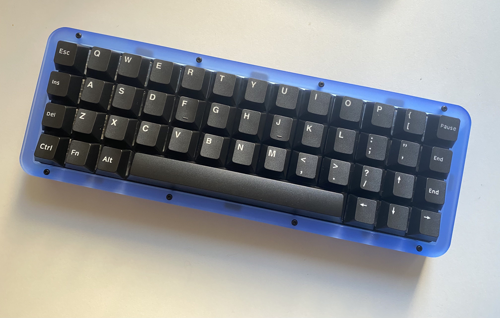

## Louhi

Louhi is a DIY 50% mechanical keyboard PCB, with an ortho layout. It is meant to be fairly easy to solder and assemble.

  

Specs:

    Uses a Pro Micro, Elite-C or Proton-C (or any other controller with same form factor)
    Cherry MX Switches, PCB or plate-mount
    Support for multiple bottom layouts
    Uses one pcb-mount stabilizer
    QMK and Vial Compatible

## Supported layouts
  
## Plate
Gasket-mount universal plate files are located in the FR4-Plate folder. Uses 0.75mm thick gasket material on both sides of the plate.
